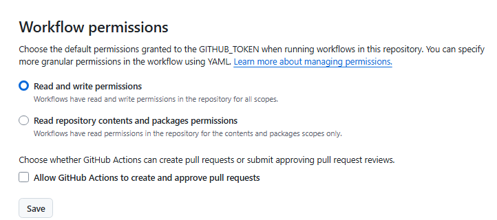

# Copilot PRs either automatically run mcp - pullrequest - live OR leaves a comment for the same

## Giving copilot `write` access to the repo

This is just a terrible plan. I don't think there is a good solution here. Maybe we add copilot to the list of contributors?

## Using github actions to post a comment about users needing to manually run.

See `check-actions.yml` in this repo.

Cons:

- Workflow permissions. USers will still need to approve the github action to run because the user doesn't have write access. (Pretty certain this is more than a onetime deal? Will confirm on my repo over multiple copilot PRs)
- Need separate run that appears as a check
- Need to enable workflows having write permission  on the repo if it's not already there

Pros:

- Easily customizable
- Works pretty consistently
- Good security story (pull_request_target), just leaving a comment so not a huge deal
